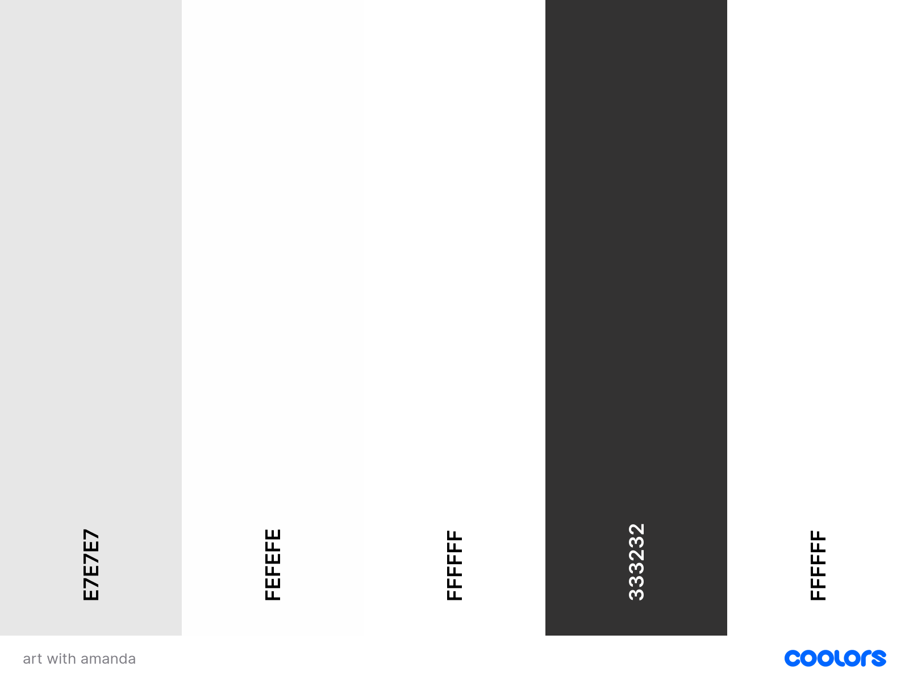

# Art with Amanda 

Art with Amanda is a full-stack e-commerce website that I developed as my final milestone project for the Level 5 Diploma in Web Development with Code Institute. As an artist, I built this platform using Django, Python, HTML, CSS, and JavaScript to showcase and sell my original artworks and prints. With Stripe integration for secure payments, the website provides a user-friendly interface where visitors can explore a diverse collection of my artwork, view detailed descriptions, and make purchases seamlessly. This project not only highlights my artistic endeavors but also demonstrates my proficiency in web development, combining my passion for art with modern technologies to create an engaging online gallery experience.

[View website here]()

# Table of Contents

1. [User Experience](#user-experience)
    - [Project Goals](#project-goals)
    - [User Feedback and Involvement](#user-feedback-and-involvement)
    - [User Stories](#project-goals)
    - [Database Schema](#database-schema)
    - [Wireframes](#wireframes)
    - [Colour Scheme](#colour-scheme)
    - [Typography](#typography)
    - [Imagery](#imagery)
    - [Mockup](#mockup)
2. [Rationalle for Development](rationalle-for-development)
3. [Features](#features)
4. [Technologies Used](#technologies-used)
    -  [Languages](#languages)
    -  [Frameworks & Tools](#frameworks--tools)
4. [Testing](#testing)
5. [Deployment](#deployment)
6. [Credits](#credits) 
    -  [Media](#media)
    -  [Code](#code)

# User Experience 

## Project Goals

### Site Owner Goals

As the site owner of Art with Amanda, my primary goals for this website are to:

1. **Showcase Artwork**: Provide a visually appealing platform to display my art collections, allowing visitors to appreciate and engage with my work.

2. **Sell Artworks**: Implement a seamless e-commerce experience where users can purchase my artworks easily and securely through Stripe integration.

3. **Expand Reach**: Reach a broader audience by making my artwork accessible online, thus attracting potential buyers and art enthusiasts from different regions.

4. **Enhance User Experience**: Ensure a user-friendly interface with intuitive navigation, making it easy for visitors to explore the site, view detailed artwork descriptions, and complete transactions.

5. **Promote Brand Identity**: Strengthen my brand presence by maintaining a consistent aesthetic and professional presentation across the website.

By achieving these goals, I aim to not only sell my artworks but also build a lasting connection with my audience and grow my presence in the art community.

### User Goals

As a visitor to the Art with Amanda website, my goals are to:

- **Discover Art**: Easily explore a diverse collection of artwork presented in a visually appealing manner.

- **View Art Details**: Access detailed information about each artwork, including descriptions, dimensions, materials used, and pricing.

- **Purchase Art**: Seamlessly browse through available artworks, add desired items to a shopping cart, and securely complete the purchase using Stripe integration.

- **Navigate Easily**: Find my way around the website intuitively, with clear categories, and an easy-to-use interface.

- **Learn About the Artist**: Gain insights into Amanda’s artistic journey, background, and inspiration, establishing a connection with the artist.

- **Contact Artist**: Easily reach out to Amanda for inquiries, commissions, or collaborations through a contact form or provided contact details.

- **Enjoy a Seamless Experience**: Experience a responsive website that works well on different devices, ensuring a consistent and enjoyable browsing and shopping experience.

By achieving these goals, users can explore and appreciate my artwork, make informed purchasing decisions, and potentially become patrons and supporters of my artistic journey.

## User Feedback and Involvement

### Feedback Collection

Before the development of Art with Amanda began, user feedback was actively collected to ensure the website meets the needs and expectations of its target audience. Feedback was gathered through various channels, including:

- **Preliminary Discussions**: Had discussions and gathered suggestions from art friends and family members to understand their preferences, behaviors, and needs as potential buyers and art enthusiasts.

- **Instagram Community Feedback**: Posted questions and polls on my Instagram story (artwithamanda_) asking followers what they would like to see on an art selling website and gathered valuable feedback and suggestions.

### Key Points from Feedback

After collecting extensive feedback from both my Instagram community and preliminary discussions with friends and family, several key points emerged. Here are the questions I asked and a summary of the majority responses:

1. **What do you want to see on an art seller's website?**
    - High-quality images of the artwork
    - Detailed descriptions and background stories of each piece
    - Easy navigation and categorization of art pieces

2. **What features do you find most helpful in making purchasing decisions?**
    - Clear pricing and size information
    - User reviews and ratings
    - Secure and straightforward payment options

3. **What design elements do you prefer in an art selling website?**
    - Clean and minimalist design
    - High-contrast colour schemes to highlight the artwork
    - Intuitive layout with easy access to different sections

4. **How important is mobile responsiveness to your browsing experience?**
    - Extremely important: The majority of users emphasized the need for a mobile-friendly design
    - Users expect a seamless experience across all devices

#### Screenshots of Questions:
- [Question 1 Screenshot](documentation/UserFeedbackQS/Q1.JPG)
- [Question 2 Screenshot](documentation/UserFeedbackQS/Q2.JPG)
- [Question 3 Screenshot](documentation/UserFeedbackQS/Q3.JPG)
- [Question 4 Screenshot](documentation/UserFeedbackQS/Q4.JPG)

### Poll Results

Here are the results of the polls:

- [Poll 1 Screenshot](documentation/UserFeedbackPolls/IMG_3129.PNG)
- [Poll 2 Screenshot](documentation/UserFeedbackPolls/IMG_3130.jpg)
- [Poll 3 Screenshot](documentation/UserFeedbackPolls/IMG_3131.jpg)
- [Poll 4 Screenshot](documentation/UserFeedbackPolls/IMG_3132.jpg)
- [Poll 5 Screenshot](documentation/UserFeedbackPolls/IMG_3133.jpg)

### Incorporating Feedback

User feedback played a crucial role in shaping the development of Art with Amanda. While I took into account the suggestions and preferences of my community, it's also important to maintain my own vision and personal style for the website. Key areas where feedback influenced decision-making include:

- **Navigation Improvements**: Made adjustments to improve the clarity and intuitiveness of the website's navigation menus and category organization based on expected user feedback.

- **Content Presentation**: Enhanced how information such as descriptions, dimensions, and materials used is displayed to users, ensuring a more informative and engaging experience.

- **Mobile Responsiveness**: Optimized the website to ensure a seamless browsing and shopping experience across various devices and screen sizes.

- **Design Choices**: For aspects like typography and colour schemes, I provided options that I liked and then asked the Instagram community to vote on their preferences. This collaborative approach ensured that the final design elements resonated well with the broader audience while still reflecting my artistic vision.

### Continuous Improvement

User feedback remains an important part of Art with Amanda's ongoing development and growth strategy. I will continue to actively seek suggestions and feedback from the audience throughout the development process, periodically asking for input on my Instagram and from friends and family. This approach ensures that the website evolves to meet the preferences and needs of its users, maintaining a user-centric approach to its development.

## User Stories
| User Story ID | As a/an | I want to be able to ... | So that I can... |
| :--- | :--- | :--- | :---|
| **VIEWING & NAVIGATION** |
| 1 | Shopper | Easily navigate the site | find artwork/information that I need. |
| 2 | Shopper | Easily contact the artist | ask any questions about anything I'm interested in, like a commission. |
| 3 | Shopper | Learn about the artist | gain insights into the artist's background and journey. |
| 4 | Shopper | View a category/filter of artwork, e.g., originals/prints | find specific art items I am interested in without having to scroll through all artwork. |
| 5 | Shopper | View more details on artwork | see descriptions, dimensions, material used, and sizing. |
| 6 | Shopper | View my running total of purchases throughout my visit | make sure I don't overspend & can track whether I meet any site offers (e.g., free delivery). |
| **REGISTRATION & USER ACCOUNTS** |
| 7 | Shopper | Easily register for an account | have a personal account and view my profile. |
| 8 | Shopper | Receive an email to confirm my registration | verify my account was created successfully. |
| 9 | Shopper | Log in and out | access my personal account and keep my account information secure. |
| 10 | Shopper | View a profile page | view my previous orders and key information. |
| 11 | Shopper | Reset my password | recover access to my account. |
| **SORTING & SEARCHING** |
| 12 | Shopper | Sort the list of available artworks | easily identify the best-priced and categorically sorted artworks. |
| 13 | Shopper | Sort a specific category of artworks | find the best-priced artwork in a specific category, or sort the artworks by name. |
| 14 | Shopper | Easily see what I've searched for and the number of results | quickly decide whether the product I want is available. |
| **PURCHASING & CHECKOUT** |
| 15 | Shopper | Easily select size and quantity of artwork when purchasing it | ensure I don't select the wrong size or quantity. |
| 16 | Shopper | View items in my bag to be purchased | see the total cost of my purchase and all items I will receive. |
| 17 | Shopper | Adjust the quantity of individual items in my bag | easily make changes to my purchase before checkout. |
| 18 | Shopper | Easily enter my payment information | check out quickly and with no problems. |
| 19 | Shopper | Feel my personal and payment information is safe and secure | confidently provide the needed information to make a purchase. |
| 20 | Shopper | View an order confirmation after checkout | verify that I haven't made any mistakes. |
| 21 | Shopper | Receive an email confirmation after checking out | keep the confirmation of what I've purchased for my records. |
| **ADMIN & STORE MANAGEMENT** |
| 22 | Store Owner | Add artwork | add new art pieces to my store. |
| 23 | Store Owner | Edit/update a product | change art piece prices, descriptions, images, and other criteria. |
| 24 | Store Owner | Delete a product | remove items that are no longer for sale. |

## Database schema 

## Wireframes
In the initial stages of designing Art with Amanda, I created rough sketches to visualize the layout and structure of the website. These sketches served as a blueprint for the final wireframes and helped shape the overall user experience. Below are the images of these sketches:
- [Photo 1](documentation/Wireframes1/IMG_3139.jpg)
- [Photo 2](documentation/Wireframes1/IMG_3140_2.jpg)
- [Photo 3](documentation/Wireframes1/IMG_3141_2.jpg)
- [Photo 4](documentation/Wireframes1/IMG_3142_2.jpg)

### Final Wireframes

After refining my initial sketches, I created detailed wireframes using Figma, a versatile and powerful design tool known for its collaborative features and ease of use. Figma allowed me to add images and create precise, polished representations of the website's layout. Below are the finalized wireframes:

#### Home Page

For the home page, I developed two different options and sought feedback from the Instagram community, as well as from family and friends, to determine which layout they preferred. The majority favored the first layout, so I decided to proceed with this design.

- **Option 1**: [View Wireframe](documentation/FinalWireframes/wf1.png)
- **Option 2**: [View Wireframe](documentation/FinalWireframes/wf2.png)
- **Phone View**: [View Wireframe](documentation/FinalWireframes/homepagephone.png)
- **Tablet View**: [View Wireframe](documentation/FinalWireframes/homepagetablet.png)

#### Shop Page

The shop page was designed to provide a seamless shopping experience across different devices. It features a clean layout that highlights the products, with easy filtering and sorting options to help users find what they are looking for quickly. The wireframes include detailed views for different devices:

- **Desktop View**: [View Wireframe](documentation/FinalWireframes/Screenshot%202024-06-18%20at%2014.52.42.png)
- **Phone View**: [View Wireframe](documentation/FinalWireframes/shoppagephone.png)
- **Tablet View**: [View Wireframe](documentation/FinalWireframes/Screenshot%202024-06-18%20at%2014.56.13.png)

#### Art Product Page

The art product page showcases individual artworks with detailed descriptions and images. This page is designed to provide all the necessary information about each piece, including high-quality images, descriptions, quantity, and pricing. The wireframes demonstrate how these elements are organized for clarity and ease of use:

- **Desktop View**: [View Wireframe](documentation/FinalWireframes/artfdetaildesktop.png)
- **Phone View**: [View Wireframe](documentation/FinalWireframes/artdetailphone.png)

#### Contact Page

The contact page ensures users can easily reach out with inquiries or feedback. It includes a straightforward contact form, clear instructions, and additional contact information such as email and phone numbers. This page is designed to be user-friendly and accessible:

- **Desktop View**: [View Wireframe](documentation/FinalWireframes/contactpagedesktop.png)

#### Account/Login/Sign Up Page

The account, login, and sign up pages were designed to streamline the user authentication process, ensuring a smooth and user-friendly experience. These wireframes include the following features:

- **Account Page**: Allows users to view and update their personal information, manage their password, and view their order history.
- **Login Page**: Provides a simple and secure interface for users to enter their credentials and access their accounts. It includes options for forgotten passwords and social media logins.
- **Sign Up Page**: Offers a straightforward registration form for new users, with fields for necessary personal information and security features to protect user data.

#### Shopping Bag Page

The shopping bag page wireframes were designed to provide users with a clear overview of their selected items, allowing for easy modifications to quantities and facilitating a straightforward checkout process. Key features include:

- **Item List**: Displays all selected items with thumbnails, names, prices, and quantity selectors.
- **Total Price**: Shows a summary of the total cost.
- **Checkout Button**: A prominent button that directs users to the secure checkout page.
- **Remove Item Option**: Allows users to easily remove items from their shopping bag.

### Next Steps

With the wireframes finalized, I used them as a blueprint during the development phase to ensure the website aligns with the chosen layout and effectively meets user needs.

## Colour Scheme

In developing the Art with Amanda website, I prioritized a modern and simplistic design to ensure that my artwork remains the focal point. Based on user feedback, I selected a colour palette consisting of different shades of white and black. This neutral colour scheme helps to create a clean, elegant, and professional look that doesn't distract from the art photos.

Colour Palette

 

The following is an overview of how the colour scheme is applied across different sections of the website:

- **Backgrounds**: The primary background colour is white, providing a bright and clean canvas for the artwork.
- **Text**: The main text colour is black, and white on dark backgrounds, ensuring high readability and contrast.
- **Borders and Dividers**: A light grey is used for subtle borders and dividers, adding structure to the layout without drawing attention away from the artwork.
- **Buttons and Links**: Buttons and interactive elements are styled in a black shade to stand out and be easily identifiable.

### User Feedback Integration

The decision to use a simple and neutral colour scheme was directly influenced by user feedback. Through preliminary discussions and Instagram polls, users expressed a preference for a minimalist design that highlights the artwork rather than the website itself. By adopting this feedback, the final colour scheme enhances the user experience and ensures that the artwork remains the central focus of the site.

By maintaining a consistent and simplistic colour scheme, the website provides a cohesive and enjoyable user experience that directs attention to the artwork while ensuring readability and ease of navigation.

## Typography

The typography for the Art with Amanda website is inspired by my logo, which features the Arapey font. To complement Arapey, I researched fonts that pair well with it and discovered Raleway. This combination was recommended by a resource on the best free Google Fonts, which you can find [here](https://daveyandkrista.com/best-free-google-fonts/#:~:text=Arapey%20would%20look%20great%20in,serif%20like%20Questrial%20or%20Raleway.).

### Font Choices

- **Arapey**: This elegant serif font is used for the headings. Its classic and sophisticated style adds a touch of refinement to the website, making it ideal for drawing attention to key areas like titles and section headers.
- **Raleway**: This clean and modern sans-serif font is used for body text. Raleway’s readability and contemporary appearance provide a nice contrast to Arapey, ensuring that the content is easy to read and visually appealing.

### Application

The consistent use of these two fonts helps to create a cohesive and elegant look throughout the website. Here is how they are applied:

- **Headings (Arapey)**: All major headings, including section titles use the Arapey font. This helps to create a hierarchy and guide the user’s attention to important information.
- **Body Text (Raleway)**: All body text, including descriptions and general content, uses the Raleway font. This ensures that the text is clear and easy to read, contributing to a pleasant user experience.

By carefully selecting and pairing these fonts, the website achieves a harmonious visual experience that enhances readability while maintaining an elegant and professional appearance. This thoughtful typography choice reflects the overall aesthetic of the Art with Amanda brand, balancing artistic elegance with modern design principles.

## Imagery

The imagery for the Art with Amanda website plays a crucial role in showcasing the artwork in its best light. All photographs of my art are captured using an iPhone 12, which is the primary camera I have available. I aim to capture the artworks as close to their real appearance as possible, with minimal editing to ensure authenticity and preserve the artwork's natural beauty.

### Photography Process

1. **Capture**: Using the iPhone 12, I carefully photograph each artwork to ensure that the colours are accurate and the details are captured as they appear in real life.
   
2. **Minimal Editing**: After capturing the photos, I may do some simple edits to enhance the photograph and ensure it accurately represents the artwork's beauty. This may include adjusting brightness, contrast, and colour saturation to match the artwork's true appearance.

### Importance of Authentic Imagery

Authentic and high-quality imagery is crucial for an online art gallery as it allows potential buyers to see the artwork in detail and make informed decisions about their purchases. By using the iPhone 12 as my primary camera and minimizing editing, I ensure that each piece is represented authentically, creating a compelling visual experience for visitors to the website.

### Sample Photographs

Here are some examples of the artwork photographs taken with the iPhone 12 for the Art with Amanda website:

- [Photo 1](documentation/Imagery/jake_drawing.jpg)
- [Photo 2](documentation/Imagery/IMG_3255.jpg)
- [Photo 3](documentation/Imagery/zoOQO.jpeg)

These photographs demonstrate the clarity, detail, and colours captured with the iPhone 12, providing potential buyers with a true-to-life view of the artwork available for purchase.

## Mockup
For the Art with Amanda website, I created mockups to visualize the layout and design before development. These mockups were created using Wix, allowing me to experiment with different designs and user interfaces. Mockups help in understanding the overall structure of the website and provide a preview of how the final product will look and feel.

### Mockup Tool Used

I used **Wix** to create the mockups for Art with Amanda. Wix's drag-and-drop interface enabled me to design and customize various elements of the website easily.

### Screens Mocked Up

I created mockups for six key screens to explore different aspects of the website:

1. **Home Page**: This includes the main landing area, about the artist, and navigation.

2. **Artwork Listing Page**: A page showcasing all artworks with filtering and sorting options.

3. **Artwork Detail Page**: Detailed view of a single artwork with description, price, and options to purchase.

5. **Contact Page**: Form for visitors to reach out to Amanda for inquiries, commissions, or collaborations.

6. **Shopping Cart and Checkout**: Layout for viewing items in the cart, adjusting quantities, and completing the purchase through Stripe integration.

### Benefits of Mockups

- **Visualization**: Mockups provide a visual representation of the website's structure and layout.
- **Feedback**: They help gather feedback from stakeholders and potential users before development.
- **Planning**: Mockups aid in planning the user experience (UX) and user interface (UI) design.

### Example Mockup

Below is an example of the mockup for the Home Page created using Wix:

- [Home Page Mockup](documentation/Screenshot%202024-06-17%20at%2019.39.39.png)

### Next Steps

With the mockups finalized, I used them as a reference during the development phase to ensure the website aligns with the original vision and meets user needs effectively.

## Rationale for Development

The development of Art with Amanda was driven by several key factors:

1. **Market Demand**: There is a growing demand for unique, accessible, and online artwork purchasing options. This website aims to meet this demand by providing a platform for art enthusiasts to discover and purchase original artworks and prints.

2. **Personal Brand Growth**: As an artist, creating an online presence is crucial for expanding reach and establishing a brand. This website serves as a central hub for showcasing my work and interacting with potential buyers.

3. **User-Centric Design**: By prioritizing user feedback and involvement, the website development process ensures that the end product is aligned with user needs and preferences, enhancing the overall user experience.

4. **Technology Integration**: Leveraging modern web development technologies, such as Django for the backend and Stripe for secure payments, ensures a robust, scalable, and secure platform.

5. **Educational Milestone**: This project represents a significant milestone in my web development education, demonstrating the practical application of skills learned during my Level 5 Diploma in Web Development with Code Institute.

